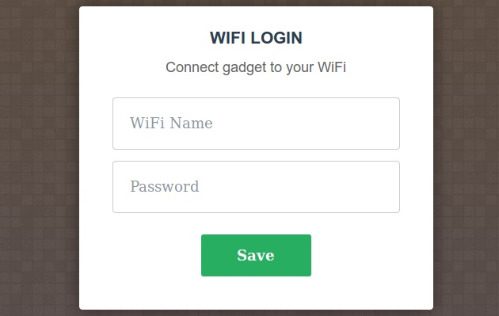

# enduser setup Module
| Since  | Origin / Contributor  | Maintainer  | Source  |
| :----- | :-------------------- | :---------- | :------ |
| 2015-09-02 | [Robert Foss](https://github.com/robertfoss) | [Robert Foss](https://github.com/robertfoss) | [enduser_setup.c](../../../app/modules/enduser_setup.c)|

This module provides a simple way of configuring ESP8266 chips without using a serial interface or pre-programming WiFi credentials onto the chip.



After running [`enduser_setup.start()`](#enduser_setupstart) a portal like the above can be accessed through a wireless network called SetupGadget_XXXXXX. The portal is used to submit the credentials for the WiFi of the enduser.
After an IP address has been successfully obtained this module will stop as if [`enduser_setup.stop()`](#enduser_setupstop) had been called.

## enduser_setup.manual()

Controls whether manual AP configuration is used.

By default the `enduser_setup` module automatically configures an open access point when starting, and stops it when the device has been successfully joined to a WiFi network. If manual mode has been enabled, neither of this is done. The device must be manually configured for `wifi.SOFTAP` mode prior to calling `enduser_setup.start()`. Additionally, the portal is not stopped after the device has successfully joined to a WiFi network.


#### Syntax
`enduser_setup.manual([on_off])`

#### Parameters
  - `on_off` a boolean value indicating whether to use manual mode; if not given, the function only returns the current setting.

#### Returns
The current setting, true if manual mode is enabled, false if it is not.

#### Example
```lua
wifi.setmode(wifi.STATIONAP)
wifi.ap.config({ssid="MyPersonalSSID",auth=wifi.AUTH_OPEN})
enduser_setup.manual(true)
enduser_setup.start(
  function()
    print("Connected to wifi as:" .. wifi.sta.getip())
  end,
  function(err, str)
    print("enduser_setup: Err #" .. err .. ": " .. str)
  end
);
```

## enduser_setup.start()

Starts the captive portal.

#### Syntax
`enduser_setup.start([onConnected()], [onError(err_num, string)], [onDebug(string)])`

#### Parameters
 - `onConnected()` callback will be fired when an IP-address has been obtained, just before the enduser_setup module will terminate itself
 - `onError()` callback will be fired if an error is encountered. `err_num` is a number describing the error, and `string` contains a description of the error.
 - `onDebug()` callback is disabled by default. It is intended to be used to find internal issues in the module. `string` contains a description of what is going on.

#### Returns
`nil`

#### Example
```lua
enduser_setup.start(
  function()
    print("Connected to wifi as:" .. wifi.sta.getip())
  end,
  function(err, str)
    print("enduser_setup: Err #" .. err .. ": " .. str)
  end
);
```

## enduser_setup.stop()

Stops the captive portal.

#### Syntax
`enduser_setup.stop()`

#### Parameters
none

#### Returns
`nil`
